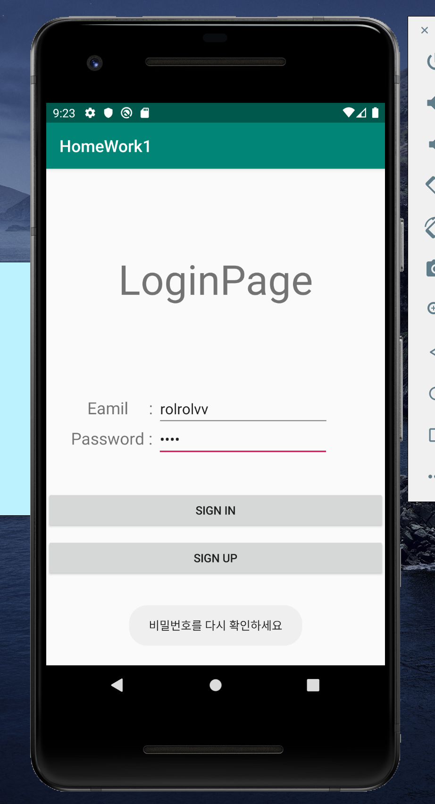
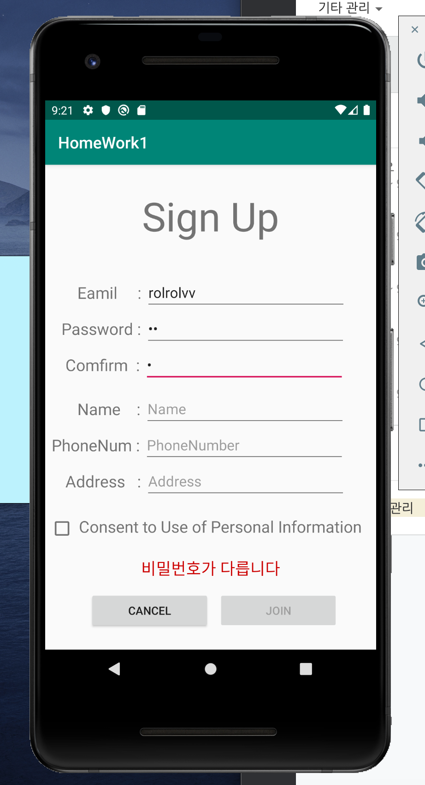
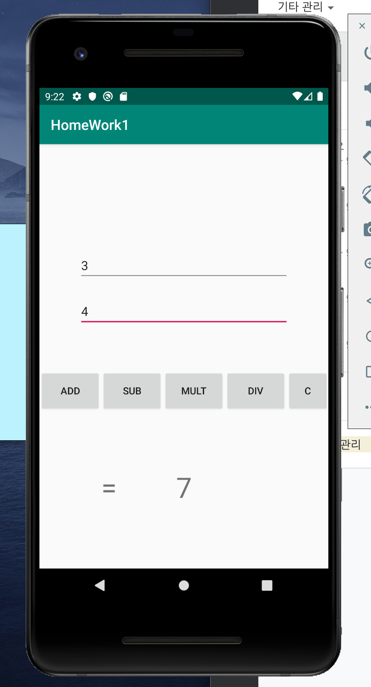

모바일 프로그래밍 개인과제 1 

맥os환경입니다 

첫번째 페이지는 로그인 페이지입니다. 
Editview로 아이디와 패스워드를 입력하게 하였고 
파일에 있는 아이디와 비밀번호가 다르면 로그인 할 수 없게 구현하였습니다.(FileReader) 
아이디와 비밀번호를 하나의 파일에 저장하고 HashMap으로 key와 value를  
이용하여 로그인할 수 있게 하였습니다 

 
두번째 페이지는 회원가입 페이지 입니다. 
아이디와 비밀번호와 개인정보를 입력하게 하였고 
비밀번호 확인으로 사용자에게 비밀번호를 한번 더 확인할 수 있게 하였습니다. 
그리고 체크박스를 클릭하지 않으면 Join 버튼이 활성화 되지 않도록 하였습니다.
 
Join 버튼을 누르면 data/data/com.example.homework1(패키지명)/files안에
txt파일이 있고 그안에 아이디와 비밀번호가 등록됩니다.(FileWriter) 
 
마지막 페이지는 계산기 입니다 
간단 계산기를 구현하였고 Editview에는 숫자와 소수점, 부호만 입력가능하도록
하였습니다 
각 버튼 클릭시 해당연산이 이루어지고 Result에 값이 써집니다. 

